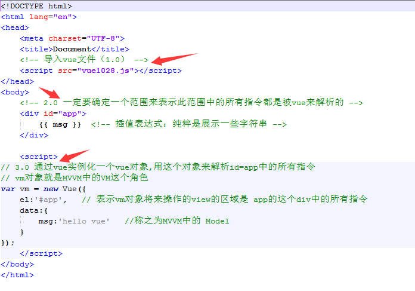

# 学习笔记

## 什么是MVVM模式？

* MVVM拆分解释为：
    * Model：负责数据储存
    * View：负责页面展示
    * View Model：负责业务逻辑处理（比如Ajax请求等），对数据进行加工后交给视图展示
* MVVM要解决的问题是将业务逻辑代码与视图代码进行完全分离，使各自的职责更加清晰，后期代码维护更加简单
* 用图解的形式分析Ajax请求后回来数据后直接操作Dom来达到视图的更新的缺点，以及使用MVVM模式是如何来解决这个缺点的
* Vue中的MVVM 


## Vue的编写步骤



## Vue的常用系统指令

* 插值表达式{{}}
* v-text
* v-html
* v-cloak
```html
v-cloak指令保持在元素上直到关联实例结束编译后自动移除，v-cloak和 CSS 规则如 [v-cloak] { display: none } 一起用时，这个指令可以隐藏未编译的 Mustache 标签直到实例准备完毕。
  通常用来防止{{}}表达式闪烁问题
  例如：
  <style>
   [v-cloak] { display: none } 
  </style>

   <!-- 在span上加上 v-cloak和css样式控制以后，浏览器在加载的时候会先把span隐藏起来，知道 Vue实例化完毕以后，才会将v-cloak从span上移除，那么css就会失去作用而将span中的内容呈现给用户 -->
  <span v-cloak>{{msg}}</span>    

   new Vue({
            data:{
                msg:'hello ivan'
              }
        })
```
* v-model
```html
1、在表单控件或者组件上创建双向绑定
 2、v-model仅能在如下元素中使用：
    input
    select
    textarea
    components（Vue中的组件）

 3、举例：
    <input type="text" v-model="uname" />

  new Vue({
           data:{
               uname:'' //这个属性值和input元素的值相互一一对应，二者任何一个的改变都会联动的改变对方
             }
       })
```
* v-bind
```html
作用：可以给html元素或者组件动态地绑定一个或多个特性，例如动态绑定style和class
缩写形式“：”
```
* v-for
* v-if
* v-show
* v-on(缩写形式“@”)

## 管道（pipe）（|）
特点：上一级的输出等于下一级的输入

